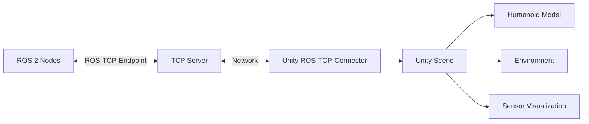

# Chapter 5: Unity for High-Fidelity Visualization

## Learning Objectives

- Understand Unity's role in robotics visualization
- Set up Unity with ROS 2 integration
- Create photorealistic environments for human-robot interaction
- Implement ROS-TCP-Connector for data exchange
- Visualize sensor data (LiDAR, camera) in Unity
- Build interactive scenarios for testing humanoid behaviors

## Why Unity for Robotics?

While Gazebo excels at physics simulation, **Unity** offers:

| Feature | Gazebo | Unity |
|---------|--------|-------|
| **Graphics Quality** | Moderate | Photorealistic (HDRP) |
| **Human Animation** | Limited | Advanced (Mecanim) |
| **UI/UX** | Basic | Professional game engine tools |
| **VR/AR Support** | None | Native |
| **Asset Ecosystem** | Small | Massive (Asset Store) |

**Use Cases**:
- **Human-Robot Interaction (HRI)**: Test how humans react to robots
- **Marketing/Demos**: High-quality visualizations for stakeholders
- **Data Visualization**: Real-time sensor data overlays
- **Digital Twins**: Mirror physical robots in virtual environments

## Unity + ROS 2 Architecture



**Components**:
1. **ROS-TCP-Endpoint**: ROS 2 package that acts as a TCP server
2. **ROS-TCP-Connector**: Unity package that connects to the server
3. **Message Serialization**: Converts ROS messages to Unity-compatible format

## Setting Up Unity with ROS 2

### Step 1: Install Unity Hub

```bash
# Download Unity Hub from https://unity.com/download
# Install Unity 2022.3 LTS (Long Term Support)
```

### Step 2: Create New Unity Project

1. Open Unity Hub
2. Click "New Project"
3. Select "3D (HDRP)" template for photorealistic rendering
4. Name: "HumanoidRoboticsViz"

### Step 3: Install ROS-TCP-Connector

1. In Unity, go to **Window > Package Manager**
2. Click **+ > Add package from git URL**
3. Enter: `https://github.com/Unity-Technologies/ROS-TCP-Connector.git?path=/com.unity.robotics.ros-tcp-connector`

### Step 4: Install ROS-TCP-Endpoint (ROS 2 side)

```bash
cd ~/ros2_ws/src
git clone https://github.com/Unity-Technologies/ROS-TCP-Endpoint.git
cd ~/ros2_ws
colcon build --packages-select ros_tcp_endpoint
source install/setup.bash
```

### Step 5: Configure Connection

In Unity:
1. **Robotics > ROS Settings**
2. Set **ROS IP Address**: `127.0.0.1` (localhost)
3. Set **ROS Port**: `10000`

Launch ROS-TCP-Endpoint:

```bash
ros2 run ros_tcp_endpoint default_server_endpoint --ros-args -p ROS_IP:=0.0.0.0
```

## Importing a Humanoid Model

### Option 1: URDF Importer

Unity has a URDF importer package:

```bash
# In Unity Package Manager, add:
https://github.com/Unity-Technologies/URDF-Importer.git?path=/com.unity.robotics.urdf-importer
```

**Steps**:
1. **Assets > Import Robot from URDF**
2. Select your `humanoid.urdf` file
3. Unity will create GameObjects for each link and joint

### Option 2: FBX/OBJ Models

For higher visual quality:
1. Export robot meshes from CAD (SolidWorks, Fusion 360) as FBX
2. Import into Unity
3. Manually configure joints using **Articulation Body** components

## Visualizing ROS Topics in Unity

### Example: Visualizing Joint States

**ROS 2 Side** (Publishing joint states):

```python
import rclpy
from rclpy.node import Node
from sensor_msgs.msg import JointState
import math

class JointStatePublisher(Node):
    def __init__(self):
        super().__init__('joint_state_publisher')
        self.publisher_ = self.create_publisher(JointState, 'joint_states', 10)
        self.timer = self.create_timer(0.05, self.publish_joint_states)
        self.angle = 0.0
    
    def publish_joint_states(self):
        msg = JointState()
        msg.header.stamp = self.get_clock().now().to_msg()
        msg.name = ['hip', 'knee', 'ankle']
        
        # Simulate walking motion
        self.angle += 0.05
        msg.position = [
            math.sin(self.angle),
            abs(math.sin(self.angle)) * 1.5,
            math.sin(self.angle) * 0.3
        ]
        
        self.publisher_.publish(msg)

def main():
    rclpy.init()
    node = JointStatePublisher()
    rclpy.spin(node)
```

**Unity Side** (C# Script):

```csharp
using UnityEngine;
using Unity.Robotics.ROSTCPConnector;
using RosMessageTypes.Sensor;

public class JointStateSubscriber : MonoBehaviour
{
    public ArticulationBody hipJoint;
    public ArticulationBody kneeJoint;
    public ArticulationBody ankleJoint;
    
    void Start()
    {
        ROSConnection.GetOrCreateInstance().Subscribe<JointStateMsg>(
            "joint_states", UpdateJointStates);
    }
    
    void UpdateJointStates(JointStateMsg msg)
    {
        if (msg.name.Length >= 3)
        {
            SetJointPosition(hipJoint, msg.position[0]);
            SetJointPosition(kneeJoint, msg.position[1]);
            SetJointPosition(ankleJoint, msg.position[2]);
        }
    }
    
    void SetJointPosition(ArticulationBody joint, double targetPosition)
    {
        var drive = joint.xDrive;
        drive.target = (float)(targetPosition * Mathf.Rad2Deg);
        joint.xDrive = drive;
    }
}
```

## Visualizing LiDAR Data

**Unity Script** (`LidarVisualizer.cs`):

```csharp
using UnityEngine;
using Unity.Robotics.ROSTCPConnector;
using RosMessageTypes.Sensor;

public class LidarVisualizer : MonoBehaviour
{
    public GameObject pointPrefab;
    private GameObject[] points;
    
    void Start()
    {
        ROSConnection.GetOrCreateInstance().Subscribe<LaserScanMsg>(
            "scan", VisualizeLidar);
        
        // Pre-instantiate point cloud
        points = new GameObject[640];
        for (int i = 0; i < points.Length; i++)
        {
            points[i] = Instantiate(pointPrefab, transform);
            points[i].transform.localScale = Vector3.one * 0.05f;
        }
    }
    
    void VisualizeLidar(LaserScanMsg scan)
    {
        float angle = scan.angle_min;
        for (int i = 0; i < scan.ranges.Length && i < points.Length; i++)
        {
            float range = scan.ranges[i];
            if (range > scan.range_min && range < scan.range_max)
            {
                float x = range * Mathf.Cos(angle);
                float z = range * Mathf.Sin(angle);
                points[i].transform.localPosition = new Vector3(x, 0, z);
                points[i].SetActive(true);
            }
            else
            {
                points[i].SetActive(false);
            }
            angle += scan.angle_increment;
        }
    }
}
```

## Creating Photorealistic Environments

### Using HDRP (High Definition Render Pipeline)

1. **Lighting**:
   - Add **Directional Light** (sun)
   - Add **HDRI Sky** for realistic ambient lighting
   - Enable **Global Illumination** (baked or real-time)

2. **Materials**:
   - Use **Lit Shader** with PBR (Physically Based Rendering)
   - Add **Normal Maps** for surface detail
   - Use **Metallic/Smoothness** maps for realistic surfaces

3. **Post-Processing**:
   - Add **Post-Process Volume**
   - Enable **Bloom**, **Ambient Occlusion**, **Motion Blur**

### Example: Home Environment

```csharp
// Script to spawn furniture procedurally
using UnityEngine;

public class HomeEnvironmentGenerator : MonoBehaviour
{
    public GameObject[] furniturePrefabs;
    
    void Start()
    {
        // Spawn a table
        Instantiate(furniturePrefabs[0], new Vector3(2, 0, 0), Quaternion.identity);
        
        // Spawn chairs
        Instantiate(furniturePrefabs[1], new Vector3(1.5f, 0, 0.5f), Quaternion.Euler(0, 90, 0));
        Instantiate(furniturePrefabs[1], new Vector3(2.5f, 0, 0.5f), Quaternion.Euler(0, -90, 0));
    }
}
```

## Human Animation with Mecanim

Unity's **Mecanim** system allows realistic human animations:

1. Import human character from **Mixamo** (free rigged characters)
2. Create **Animator Controller** with states (idle, walk, run)
3. Use **Blend Trees** for smooth transitions

**Example: Human Walking Toward Robot**

```csharp
using UnityEngine;
using UnityEngine.AI;

public class HumanAgent : MonoBehaviour
{
    public Transform robot;
    private NavMeshAgent navAgent;
    private Animator animator;
    
    void Start()
    {
        navAgent = GetComponent<NavMeshAgent>();
        animator = GetComponent<Animator>();
    }
    
    void Update()
    {
        // Walk toward robot
        navAgent.SetDestination(robot.position);
        
        // Update animation based on speed
        float speed = navAgent.velocity.magnitude;
        animator.SetFloat("Speed", speed);
    }
}
```

## Lab Exercise: Visualizing a Walking Humanoid

### Objective
Create a Unity scene that:
1. Displays a humanoid robot receiving joint commands from ROS 2
2. Shows LiDAR data as a point cloud
3. Includes a photorealistic environment

### Step 1: Set Up ROS 2 Publisher

```bash
ros2 run humanoid_leg_description joint_state_publisher
```

### Step 2: Create Unity Scene

1. Import humanoid URDF
2. Add `JointStateSubscriber.cs` script
3. Create a floor plane with PBR material
4. Add HDRI lighting

### Step 3: Test Connection

1. Launch ROS-TCP-Endpoint
2. Press Play in Unity
3. Verify robot joints move in sync with ROS 2 commands

## Quiz

1. **What is Unity's primary advantage over Gazebo?**
   - A) Better physics
   - B) Photorealistic graphics and HRI
   - C) Faster simulation
   - D) Easier to learn
   
   **Answer: B**

2. **What does ROS-TCP-Connector do?**
   - A) Simulates physics
   - B) Bridges ROS 2 and Unity via TCP
   - C) Renders 3D models
   - D) Compiles C++ code
   
   **Answer: B**

3. **Which Unity component is used for robot joints?**
   - A) Rigidbody
   - B) Articulation Body
   - C) Mesh Renderer
   - D) Collider
   
   **Answer: B**

4. **What is HDRP?**
   - A) A physics engine
   - B) High Definition Render Pipeline for photorealistic graphics
   - C) A networking protocol
   - D) A scripting language
   
   **Answer: B**

## Summary

In this chapter, we integrated Unity with ROS 2 for high-fidelity visualization. We set up ROS-TCP-Connector, imported humanoid models, visualized sensor data (joint states, LiDAR), and created photorealistic environments using HDRP. Unity complements Gazebo by providing superior graphics for human-robot interaction studies and demonstrations.

**Next Chapter**: We'll explore NVIDIA Isaac Sim, the industry-leading platform for photorealistic robot simulation and synthetic data generation.
