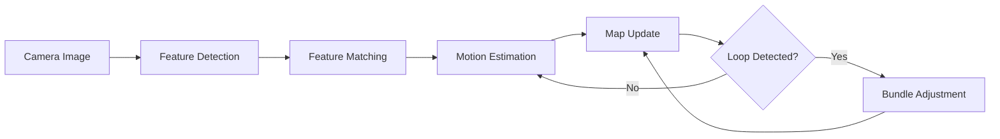
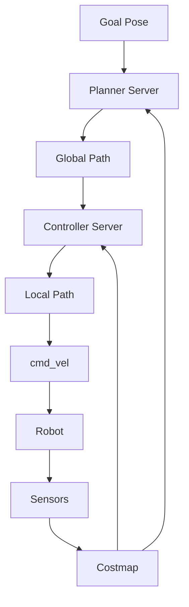

# Chapter 7: VSLAM & Navigation with Nav2

## Learning Objectives

- Understand SLAM (Simultaneous Localization and Mapping)
- Implement Visual SLAM using cameras
- Master the Nav2 stack for autonomous navigation
- Configure costmaps and planners for humanoid robots
- Implement behavior trees for complex navigation tasks
- Deploy navigation on a simulated humanoid

## What is SLAM?

**SLAM** solves the chicken-and-egg problem:
- **Localization**: Where am I? (requires a map)
- **Mapping**: What does the environment look like? (requires knowing where you are)

SLAM solves both simultaneously.

### Types of SLAM

| Type | Sensors | Use Case |
|------|---------|----------|
| **LiDAR SLAM** | 2D/3D LiDAR | Indoor navigation, warehouses |
| **Visual SLAM (VSLAM)** | Cameras (mono/stereo) | Drones, humanoids |
| **RGB-D SLAM** | Depth cameras (RealSense) | Indoor robots |
| **Inertial SLAM** | IMU + Camera | High-speed motion |

**For humanoids**: VSLAM is preferred (lightweight, human-like perception).

## Visual SLAM Fundamentals

### Key Components

1. **Feature Detection**: Identify keypoints in images (SIFT, ORB, FAST)
2. **Feature Matching**: Match keypoints across frames
3. **Motion Estimation**: Calculate camera movement (Visual Odometry)
4. **Loop Closure**: Recognize revisited locations to correct drift
5. **Bundle Adjustment**: Optimize camera poses and 3D points



### ORB-SLAM3

**ORB-SLAM3** is the state-of-the-art open-source VSLAM system.

**Features**:
- Monocular, stereo, RGB-D support
- IMU fusion
- Multi-map support
- Real-time performance

**Installation**:

```bash
cd ~/ros2_ws/src
git clone https://github.com/UZ-SLAMLab/ORB_SLAM3.git
cd ORB_SLAM3
chmod +x build.sh
./build.sh

# ROS 2 wrapper
cd ~/ros2_ws/src
git clone https://github.com/zang09/ORB_SLAM3_ROS2.git
cd ~/ros2_ws
colcon build --packages-select orb_slam3_ros2
```

**Running ORB-SLAM3**:

```bash
ros2 run orb_slam3_ros2 mono \
    /path/to/ORBvoc.txt \
    /path/to/camera_config.yaml
```

## Nav2: The ROS 2 Navigation Stack

**Nav2** is the successor to ROS 1's navigation stack, designed for production robots.

### Architecture



### Key Components

| Component | Function |
|-----------|----------|
| **Planner Server** | Computes global path (A*, Dijkstra, Theta*) |
| **Controller Server** | Follows path (DWB, TEB, MPPI) |
| **Costmap 2D** | Represents obstacles and free space |
| **Behavior Trees** | High-level task logic |
| **Recovery Behaviors** | Handle failures (rotate, back up) |

## Installing Nav2

```bash
sudo apt install ros-humble-navigation2 ros-humble-nav2-bringup
```

## Configuring Nav2 for Humanoids

### Challenge: Bipedal Locomotion

Unlike wheeled robots, humanoids:
- Have a **smaller footprint** (two feet)
- Require **dynamic balance** (can't stop instantly)
- Need **step planning** (not continuous motion)

### Costmap Configuration

Create `nav2_params.yaml`:

```yaml
costmap_2d:
  global_costmap:
    global_frame: map
    robot_base_frame: base_link
    update_frequency: 1.0
    publish_frequency: 1.0
    width: 50
    height: 50
    resolution: 0.05
    robot_radius: 0.15  # Humanoid footprint
    plugins: ["static_layer", "obstacle_layer", "inflation_layer"]
    
    static_layer:
      plugin: "nav2_costmap_2d::StaticLayer"
      map_subscribe_transient_local: True
    
    obstacle_layer:
      plugin: "nav2_costmap_2d::ObstacleLayer"
      observation_sources: scan
      scan:
        topic: /scan
        max_obstacle_height: 2.0
        clearing: True
        marking: True
    
    inflation_layer:
      plugin: "nav2_costmap_2d::InflationLayer"
      cost_scaling_factor: 3.0
      inflation_radius: 0.55

  local_costmap:
    global_frame: odom
    robot_base_frame: base_link
    update_frequency: 5.0
    publish_frequency: 2.0
    width: 3
    height: 3
    resolution: 0.05
    robot_radius: 0.15
    plugins: ["obstacle_layer", "inflation_layer"]
```

### Planner Configuration

```yaml
planner_server:
  ros__parameters:
    expected_planner_frequency: 20.0
    planner_plugins: ["GridBased"]
    GridBased:
      plugin: "nav2_navfn_planner/NavfnPlanner"
      tolerance: 0.5
      use_astar: false  # Dijkstra for safety
      allow_unknown: true
```

### Controller Configuration

For humanoids, use **Model Predictive Path Integral (MPPI)** controller:

```yaml
controller_server:
  ros__parameters:
    controller_frequency: 20.0
    controller_plugins: ["FollowPath"]
    FollowPath:
      plugin: "nav2_mppi_controller::MPPIController"
      time_steps: 56
      model_dt: 0.05
      batch_size: 2000
      vx_std: 0.2
      vy_std: 0.2
      wz_std: 0.4
      vx_max: 0.5  # Humanoid walking speed
      vx_min: -0.35
      vy_max: 0.5
      wz_max: 1.9
```

## Behavior Trees for Navigation

**Behavior Trees** (BT) allow complex decision-making.

**Example: Navigate with Recovery**

```xml
<root main_tree_to_execute="MainTree">
  <BehaviorTree ID="MainTree">
    <RecoveryNode number_of_retries="6" name="NavigateRecovery">
      <PipelineSequence name="NavigateWithReplanning">
        <RateController hz="1.0">
          <RecoveryNode number_of_retries="1" name="ComputePathToPose">
            <ComputePathToPose goal="{goal}" path="{path}" planner_id="GridBased"/>
            <ClearEntireCostmap name="ClearGlobalCostmap-Context" service_name="global_costmap/clear_entirely_global_costmap"/>
          </RecoveryNode>
        </RateController>
        <RecoveryNode number_of_retries="1" name="FollowPath">
          <FollowPath path="{path}" controller_id="FollowPath"/>
          <ClearEntireCostmap name="ClearLocalCostmap-Context" service_name="local_costmap/clear_entirely_local_costmap"/>
        </RecoveryNode>
      </PipelineSequence>
      <SequenceStar name="RecoveryActions">
        <ClearEntireCostmap name="ClearLocalCostmap-Subtree" service_name="local_costmap/clear_entirely_local_costmap"/>
        <ClearEntireCostmap name="ClearGlobalCostmap-Subtree" service_name="global_costmap/clear_entirely_global_costmap"/>
        <Spin spin_dist="1.57"/>
        <Wait wait_duration="5"/>
      </SequenceStar>
    </RecoveryNode>
  </BehaviorTree>
</root>
```

## Lab Exercise: Mapping a Room with VSLAM

### Objective
Use a simulated humanoid with a camera to build a map of a room.

### Step 1: Launch Simulation

```bash
ros2 launch humanoid_gazebo world.launch.py
```

### Step 2: Launch ORB-SLAM3

```bash
ros2 run orb_slam3_ros2 mono \
    ~/ORB_SLAM3/Vocabulary/ORBvoc.txt \
    ~/config/camera.yaml
```

### Step 3: Teleoperate Robot

```bash
ros2 run teleop_twist_keyboard teleop_twist_keyboard
```

**Task**: Drive the robot around the room to build a map.

### Step 4: Save Map

```bash
ros2 run nav2_map_server map_saver_cli -f my_room_map
```

**Output**: `my_room_map.pgm` (image) and `my_room_map.yaml` (metadata).

## Lab Exercise: Autonomous Navigation

### Step 1: Launch Nav2

```bash
ros2 launch nav2_bringup bringup_launch.py \
    map:=my_room_map.yaml \
    params_file:=nav2_params.yaml
```

### Step 2: Set Initial Pose in RViz

1. Open RViz: `ros2 run rviz2 rviz2`
2. Click "2D Pose Estimate"
3. Click on the map where the robot is

### Step 3: Set Navigation Goal

1. Click "2D Goal Pose"
2. Click on the map where you want the robot to go

**Expected**: Robot plans a path and navigates autonomously.

## Quiz

1. **What does SLAM stand for?**
   - A) Simultaneous Laser and Mapping
   - B) Simultaneous Localization and Mapping
   - C) Sensor Localization and Movement
   - D) Spatial Learning and Memory
   
   **Answer: B**

2. **Which sensor is used in Visual SLAM?**
   - A) LiDAR
   - B) Camera
   - C) Ultrasonic
   - D) GPS
   
   **Answer: B**

3. **What is the role of the Planner Server in Nav2?**
   - A) Control robot motors
   - B) Compute global path from start to goal
   - C) Detect obstacles
   - D) Save maps
   
   **Answer: B**

4. **Why is MPPI controller suitable for humanoids?**
   - A) It's the fastest
   - B) It handles dynamic constraints and balance
   - C) It uses less CPU
   - D) It doesn't require sensors
   
   **Answer: B**

## Summary

In this chapter, we mastered Visual SLAM for localization and mapping using cameras. We configured the Nav2 stack for humanoid navigation, including costmaps, planners (A*, Dijkstra), and controllers (MPPI). We also explored behavior trees for complex navigation tasks. VSLAM and Nav2 are essential for autonomous humanoid robots operating in human environments.

**Next Chapter**: We'll explore Vision-Language-Action (VLA) models, the cutting-edge approach that unifies perception, reasoning, and control.
