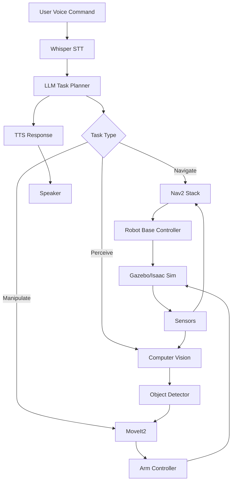

# Chapter 11: Capstone Project - The Autonomous Humanoid

## Project Overview

**Goal**: Build a simulated humanoid robot that demonstrates the full Physical AI stack:

1. **Perception**: Visual SLAM, object detection
2. **Reasoning**: Natural language understanding, task planning
3. **Action**: Navigation, manipulation, balance control
4. **Interaction**: Voice commands, conversational AI

### Project Scenario

> **Task**: "Robot, go to the kitchen, find the red cup, and bring it to me."

**Required Capabilities**:
- Speech recognition (Whisper)
- Task decomposition (GPT-4/Gemini)
- Navigation (Nav2)
- Object detection (YOLO/SAM)
- Manipulation (inverse kinematics)
- Human-robot interaction (TTS)

## System Architecture



## Phase 1: Environment Setup

### Create a Home Environment

**Gazebo World** (`home_world.sdf`):

```xml
<?xml version="1.0"?>
<sdf version="1.8">
  <world name="home">
    
    <!-- Physics -->
    <physics name="1ms" type="ignored">
      <max_step_size>0.001</max_step_size>
      <real_time_factor>1.0</real_time_factor>
    </physics>
    
    <!-- Lighting -->
    <light type="directional" name="sun">
      <pose>0 0 10 0 0 0</pose>
      <diffuse>0.8 0.8 0.8 1</diffuse>
      <direction>-0.5 0.1 -0.9</direction>
    </light>
    
    <!-- Ground -->
    <include>
      <uri>model://ground_plane</uri>
    </include>
    
    <!-- Kitchen -->
    <model name="kitchen_table">
      <static>true</static>
      <pose>3 0 0 0 0 0</pose>
      <link name="link">
        <collision name="collision">
          <geometry>
            <box><size>1.5 0.8 0.75</size></box>
          </geometry>
        </collision>
        <visual name="visual">
          <geometry>
            <box><size>1.5 0.8 0.75</size></box>
          </geometry>
          <material>
            <ambient>0.6 0.4 0.2 1</ambient>
          </material>
        </visual>
      </link>
    </model>
    
    <!-- Red Cup -->
    <model name="red_cup">
      <pose>3 0 0.85 0 0 0</pose>
      <link name="link">
        <collision name="collision">
          <geometry>
            <cylinder><radius>0.04</radius><length>0.1</length></cylinder>
          </geometry>
        </collision>
        <visual name="visual">
          <geometry>
            <cylinder><radius>0.04</radius><length>0.1</length></cylinder>
          </geometry>
          <material>
            <ambient>0.8 0.0 0.0 1</ambient>
          </material>
        </visual>
        <inertial>
          <mass>0.1</mass>
          <inertia>
            <ixx>0.0001</ixx><iyy>0.0001</iyy><izz>0.00005</izz>
          </inertia>
        </inertial>
      </link>
    </model>
    
  </world>
</sdf>
```

## Phase 2: Perception Pipeline

### Object Detection with YOLO

```python
from ultralytics import YOLO
import cv2
from cv_bridge import CvBridge

class ObjectDetector(Node):
    def __init__(self):
        super().__init__('object_detector')
        
        # Load YOLO model
        self.model = YOLO('yolov8n.pt')
        
        # ROS interfaces
        self.bridge = CvBridge()
        self.image_sub = self.create_subscription(
            Image, '/camera/image_raw', self.image_callback, 10)
        self.detection_pub = self.create_publisher(
            String, '/detected_objects', 10)
    
    def image_callback(self, msg):
        # Convert to OpenCV
        cv_image = self.bridge.imgmsg_to_cv2(msg, "bgr8")
        
        # Run detection
        results = self.model(cv_image)
        
        # Parse results
        detections = []
        for r in results:
            for box in r.boxes:
                cls = int(box.cls[0])
                conf = float(box.conf[0])
                name = self.model.names[cls]
                
                if conf > 0.5:
                    detections.append({
                        'name': name,
                        'confidence': conf,
                        'bbox': box.xyxy[0].tolist()
                    })
        
        # Publish
        msg = String()
        msg.data = str(detections)
        self.detection_pub.publish(msg)
        
        self.get_logger().info(f'Detected: {detections}')
```

### Visual SLAM for Localization

```bash
# Launch ORB-SLAM3
ros2 run orb_slam3_ros2 stereo \
    ~/ORB_SLAM3/Vocabulary/ORBvoc.txt \
    ~/config/stereo_camera.yaml
```

## Phase 3: Task Planning with LLM

### Hierarchical Task Decomposition

```python
import google.generativeai as genai
import json

class TaskPlanner:
    def __init__(self):
        genai.configure(api_key=os.getenv("GEMINI_API_KEY"))
        self.model = genai.GenerativeModel('gemini-1.5-flash')
    
    def plan(self, user_command):
        """
        Decompose high-level command into robot primitives
        """
        prompt = f"""You are a robot task planner. Decompose the user's command into a sequence of primitive actions.

Available primitives:
- navigate(location): Move to a location
- detect_object(object_name): Find an object using vision
- pick(object_name): Grasp an object
- place(location): Place held object
- say(message): Speak to user

User command: "{user_command}"

Output a JSON array of actions with parameters. Example:
[
  {{"action": "navigate", "params": {{"location": "kitchen"}}}},
  {{"action": "detect_object", "params": {{"object_name": "red cup"}}}},
  {{"action": "pick", "params": {{"object_name": "red cup"}}}},
  {{"action": "navigate", "params": {{"location": "user"}}}},
  {{"action": "place", "params": {{"location": "table"}}}},
  {{"action": "say", "params": {{"message": "Here is your red cup"}}}}
]

Only output the JSON array, no other text."""

        response = self.model.generate_content(prompt)
        
        # Parse JSON
        try:
            plan = json.loads(response.text)
            return plan
        except json.JSONDecodeError:
            self.get_logger().error(f'Failed to parse plan: {response.text}')
            return []
```

## Phase 4: Action Execution

### Navigation Action

```python
from nav2_simple_commander.robot_navigator import BasicNavigator
from geometry_msgs.msg import PoseStamped

class NavigationAction:
    def __init__(self):
        self.navigator = BasicNavigator()
    
    def execute(self, location):
        """
        Navigate to a named location
        """
        # Predefined locations
        locations = {
            'kitchen': (3.0, 0.0, 0.0),
            'living_room': (0.0, 0.0, 0.0),
            'bedroom': (0.0, 3.0, 0.0)
        }
        
        if location not in locations:
            return False
        
        # Create goal pose
        goal_pose = PoseStamped()
        goal_pose.header.frame_id = 'map'
        goal_pose.header.stamp = self.navigator.get_clock().now().to_msg()
        goal_pose.pose.position.x = locations[location][0]
        goal_pose.pose.position.y = locations[location][1]
        goal_pose.pose.orientation.w = 1.0
        
        # Navigate
        self.navigator.goToPose(goal_pose)
        
        # Wait for completion
        while not self.navigator.isTaskComplete():
            feedback = self.navigator.getFeedback()
            # Could add timeout here
        
        return self.navigator.getResult() == TaskResult.SUCCEEDED
```

### Manipulation Action (Simplified)

```python
class ManipulationAction:
    def __init__(self):
        self.arm_pub = self.create_publisher(
            JointTrajectory, '/arm_controller/joint_trajectory', 10)
    
    def pick(self, object_name):
        """
        Pick up an object
        """
        # 1. Move arm to pre-grasp position
        self.move_arm_to_position([0.0, -0.5, 0.5, 0.0, 0.0])
        
        # 2. Open gripper
        self.set_gripper(open=True)
        
        # 3. Move to grasp position (would use object detection + IK)
        self.move_arm_to_position([0.0, -0.3, 0.3, 0.0, 0.0])
        
        # 4. Close gripper
        self.set_gripper(open=False)
        
        # 5. Lift
        self.move_arm_to_position([0.0, -0.5, 0.5, 0.0, 0.0])
        
        return True
    
    def place(self, location):
        """
        Place held object
        """
        # 1. Move to place position
        self.move_arm_to_position([0.0, -0.3, 0.3, 0.0, 0.0])
        
        # 2. Open gripper
        self.set_gripper(open=True)
        
        # 3. Retract
        self.move_arm_to_position([0.0, -0.5, 0.5, 0.0, 0.0])
        
        return True
```

## Phase 5: Integration

### Main Controller

```python
class AutonomousHumanoid(Node):
    def __init__(self):
        super().__init__('autonomous_humanoid')
        
        # Components
        self.task_planner = TaskPlanner()
        self.navigator = NavigationAction()
        self.manipulator = ManipulationAction()
        self.object_detector = ObjectDetector()
        self.whisper = WhisperNode()
        self.tts = TextToSpeech()
        
        # State
        self.current_plan = []
        self.current_step = 0
    
    def run(self):
        """
        Main loop
        """
        while rclpy.ok():
            # 1. Listen for command
            command = self.whisper.listen()
            if not command:
                continue
            
            self.get_logger().info(f'Received command: "{command}"')
            self.tts.speak("I understand. Let me do that.")
            
            # 2. Plan
            self.current_plan = self.task_planner.plan(command)
            self.get_logger().info(f'Plan: {self.current_plan}')
            
            # 3. Execute
            for step in self.current_plan:
                success = self.execute_action(step)
                if not success:
                    self.tts.speak("Sorry, I encountered an error.")
                    break
            else:
                self.tts.speak("Task completed successfully!")
    
    def execute_action(self, action):
        """
        Execute a single action
        """
        action_type = action['action']
        params = action['params']
        
        self.get_logger().info(f'Executing: {action_type} with {params}')
        
        if action_type == 'navigate':
            return self.navigator.execute(params['location'])
        
        elif action_type == 'detect_object':
            # Wait for object detection
            # In practice, would actively search
            return True
        
        elif action_type == 'pick':
            return self.manipulator.pick(params['object_name'])
        
        elif action_type == 'place':
            return self.manipulator.place(params['location'])
        
        elif action_type == 'say':
            self.tts.speak(params['message'])
            return True
        
        else:
            self.get_logger().error(f'Unknown action: {action_type}')
            return False
```

## Phase 6: Testing and Validation

### Test Cases

1. **Simple Navigation**
   - Command: "Go to the kitchen"
   - Expected: Robot navigates to kitchen

2. **Object Retrieval**
   - Command: "Bring me the red cup from the kitchen"
   - Expected: Navigate → Detect → Pick → Navigate → Place

3. **Multi-Step Task**
   - Command: "Clean the table in the kitchen"
   - Expected: Navigate → Detect objects → Pick each → Place in bin

### Performance Metrics

| Metric | Target | Measurement |
|--------|--------|-------------|
| **Navigation Success Rate** | >90% | % of successful navigations |
| **Object Detection Accuracy** | >85% | Precision/Recall |
| **Manipulation Success Rate** | >80% | % of successful grasps |
| **End-to-End Task Success** | >75% | % of fully completed tasks |
| **Speech Recognition Accuracy** | >95% | Word Error Rate (WER) |

## Submission Requirements

### 1. GitHub Repository

```
capstone-humanoid-robot/
├── README.md
├── src/
│   ├── perception/
│   │   ├── object_detector.py
│   │   └── vslam_node.py
│   ├── planning/
│   │   └── task_planner.py
│   ├── control/
│   │   ├── navigation_action.py
│   │   └── manipulation_action.py
│   ├── interaction/
│   │   ├── whisper_node.py
│   │   └── tts_node.py
│   └── main_controller.py
├── launch/
│   └── capstone.launch.py
├── config/
│   ├── nav2_params.yaml
│   └── robot_description.urdf
├── worlds/
│   └── home_world.sdf
└── docs/
    ├── architecture.md
    └── demo_video.mp4
```

### 2. Demo Video (90 seconds max)

**Structure**:
- 0-10s: Introduction and scenario
- 10-30s: Voice command demonstration
- 30-60s: Robot execution (navigation, detection, manipulation)
- 60-80s: Task completion and robot response
- 80-90s: Technical highlights and conclusion

**Tips**:
- Use screen recording (OBS Studio)
- Add subtitles for voice commands
- Show RViz visualization alongside Gazebo
- Highlight key moments (object detection, successful grasp)

### 3. Documentation

**README.md** should include:
- Project overview
- System architecture diagram
- Installation instructions
- How to run the demo
- Technical challenges and solutions
- Future improvements

## Evaluation Rubric

| Category | Points | Criteria |
|----------|--------|----------|
| **Functionality** | 40 | Does it work end-to-end? |
| **Code Quality** | 20 | Clean, documented, modular |
| **Innovation** | 20 | Novel features, creative solutions |
| **Documentation** | 10 | Clear README, architecture docs |
| **Demo Video** | 10 | Professional, concise, engaging |

## Bonus Challenges

### Challenge 1: Multi-Robot Coordination
- Deploy two humanoids that collaborate on a task
- Example: One holds a box while the other places objects inside

### Challenge 2: Adaptive Behavior
- Robot learns from failures and retries with different strategies
- Example: If grasp fails, try different approach angle

### Challenge 3: Real-World Deployment
- Deploy on a physical robot (Unitree G1, custom build)
- Document sim-to-real transfer process

## Final Thoughts

This capstone project synthesizes everything you've learned:
- **ROS 2** for system architecture
- **Gazebo/Isaac Sim** for simulation
- **Nav2** for navigation
- **Computer Vision** for perception
- **LLMs** for reasoning
- **Control Theory** for manipulation

**You are now equipped to build the next generation of humanoid robots.**

## Submission

Submit your project here: [Hackathon Submission Form](https://forms.gle/CQsSEGM3GeCrL43c8)

**Required**:
- Public GitHub repository link
- Deployed book link (GitHub Pages/Vercel)
- Demo video link (YouTube/Vimeo, &lt;90 seconds)
- WhatsApp number for presentation invitation

**Deadline**: Sunday, Nov 30, 2025 at 6:00 PM

---

## Congratulations!

You've completed the Physical AI & Humanoid Robotics course. You now have the skills to:
- Design and simulate humanoid robots
- Implement perception, planning, and control systems
- Integrate AI models for natural interaction
- Deploy autonomous robots in complex environments

**The future of robotics is in your hands. Build something amazing!** 🤖🚀
