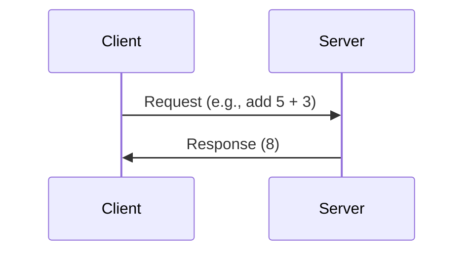
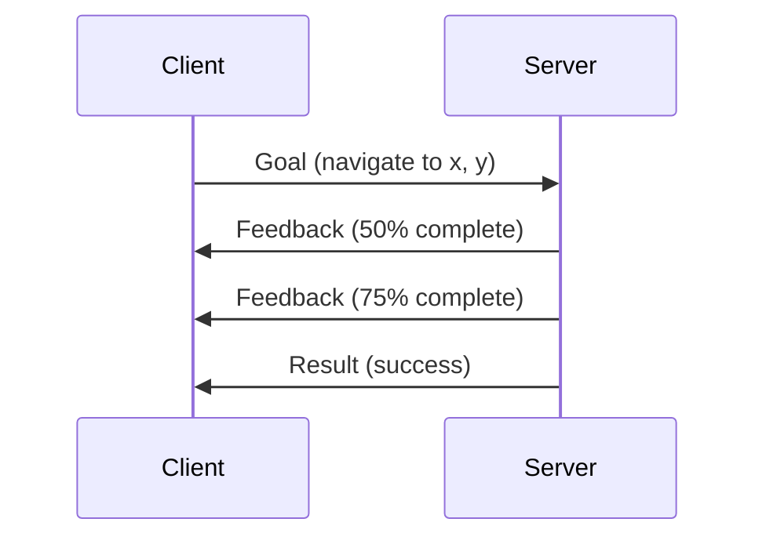

# Chapter 2: ROS 2 Fundamentals - The Robotic Nervous System

## Learning Objectives

- Understand the architecture and purpose of ROS 2
- Master core concepts: nodes, topics, services, and actions
- Build publisher and subscriber nodes in Python
- Implement service clients and servers
- Understand the DDS middleware and QoS policies
- Create launch files for complex robot systems

## What is ROS 2?

**ROS 2 (Robot Operating System 2)** is not an operating system in the traditional sense, but rather a **middleware framework** that provides:

1. **Communication Infrastructure**: Inter-process communication (IPC) between robot components
2. **Hardware Abstraction**: Standardized interfaces for sensors and actuators
3. **Package Management**: Modular, reusable software components
4. **Tools**: Visualization (RViz), simulation (Gazebo), debugging, and logging

### Why ROS 2 (vs ROS 1)?

| Feature | ROS 1 | ROS 2 |
|---------|-------|-------|
| **Real-time** | No | Yes (with DDS) |
| **Multi-robot** | Difficult | Native support |
| **Security** | None | DDS Security |
| **Platforms** | Linux only | Linux, Windows, macOS |
| **Communication** | Custom (TCPROS) | DDS (industry standard) |
| **Production** | Research | Production-ready |

**DDS (Data Distribution Service)** is an industry-standard middleware used in aerospace, defense, and automotive systems. ROS 2 leverages DDS for robust, real-time communication.

## Core Concepts

### 1. Nodes

A **node** is a process that performs a specific computation. Examples:
- Camera driver node (publishes images)
- Object detection node (subscribes to images, publishes bounding boxes)
- Motor controller node (subscribes to velocity commands, controls motors)

**Design Philosophy**: Each node should have a single, well-defined responsibility (Unix philosophy).

```python
import rclpy
from rclpy.node import Node

class MinimalNode(Node):
    def __init__(self):
        super().__init__('minimal_node')  # Node name
        self.get_logger().info('Node has been started!')

def main(args=None):
    rclpy.init(args=args)
    node = MinimalNode()
    rclpy.spin(node)  # Keep node alive
    node.destroy_node()
    rclpy.shutdown()

if __name__ == '__main__':
    main()
```

### 2. Topics (Publish-Subscribe)

**Topics** enable asynchronous, many-to-many communication. A node can:
- **Publish** messages to a topic (e.g., `/camera/image`)
- **Subscribe** to a topic to receive messages

```mermaid
graph LR
    A[Camera Node] -->|publishes| B[/camera/image]
    B -->|subscribes| C[Object Detector]
    B -->|subscribes| D[Image Saver]
    B -->|subscribes| E[Display Node]
```

**Example: Publisher**

```python
import rclpy
from rclpy.node import Node
from std_msgs.msg import String

class PublisherNode(Node):
    def __init__(self):
        super().__init__('publisher_node')
        self.publisher_ = self.create_publisher(String, 'chatter', 10)
        self.timer = self.create_timer(1.0, self.timer_callback)
        self.counter = 0
    
    def timer_callback(self):
        msg = String()
        msg.data = f'Hello ROS 2: {self.counter}'
        self.publisher_.publish(msg)
        self.get_logger().info(f'Publishing: "{msg.data}"')
        self.counter += 1

def main(args=None):
    rclpy.init(args=args)
    node = PublisherNode()
    rclpy.spin(node)
    node.destroy_node()
    rclpy.shutdown()
```

**Example: Subscriber**

```python
import rclpy
from rclpy.node import Node
from std_msgs.msg import String

class SubscriberNode(Node):
    def __init__(self):
        super().__init__('subscriber_node')
        self.subscription = self.create_subscription(
            String,
            'chatter',
            self.listener_callback,
            10)
    
    def listener_callback(self, msg):
        self.get_logger().info(f'I heard: "{msg.data}"')

def main(args=None):
    rclpy.init(args=args)
    node = SubscriberNode()
    rclpy.spin(node)
    node.destroy_node()
    rclpy.shutdown()
```

### 3. Services (Request-Response)

**Services** provide synchronous, one-to-one communication. Use cases:
- Trigger an action (e.g., "start recording")
- Query information (e.g., "what is the battery level?")



**Example: Service Server**

```python
from example_interfaces.srv import AddTwoInts
import rclpy
from rclpy.node import Node

class AddTwoIntsServer(Node):
    def __init__(self):
        super().__init__('add_two_ints_server')
        self.srv = self.create_service(
            AddTwoInts, 
            'add_two_ints', 
            self.add_two_ints_callback)
        self.get_logger().info('Service server ready.')
    
    def add_two_ints_callback(self, request, response):
        response.sum = request.a + request.b
        self.get_logger().info(f'{request.a} + {request.b} = {response.sum}')
        return response

def main(args=None):
    rclpy.init(args=args)
    node = AddTwoIntsServer()
    rclpy.spin(node)
    rclpy.shutdown()
```

**Example: Service Client**

```python
from example_interfaces.srv import AddTwoInts
import rclpy
from rclpy.node import Node
import sys

class AddTwoIntsClient(Node):
    def __init__(self):
        super().__init__('add_two_ints_client')
        self.client = self.create_client(AddTwoInts, 'add_two_ints')
        
        while not self.client.wait_for_service(timeout_sec=1.0):
            self.get_logger().info('Service not available, waiting...')
        
        self.request = AddTwoInts.Request()
    
    def send_request(self, a, b):
        self.request.a = a
        self.request.b = b
        self.future = self.client.call_async(self.request)
        return self.future

def main(args=None):
    rclpy.init(args=args)
    node = AddTwoIntsClient()
    future = node.send_request(int(sys.argv[1]), int(sys.argv[2]))
    rclpy.spin_until_future_complete(node, future)
    
    response = future.result()
    node.get_logger().info(f'Result: {response.sum}')
    
    node.destroy_node()
    rclpy.shutdown()
```

### 4. Actions (Long-Running Tasks)

**Actions** are for tasks that:
- Take time to complete (e.g., navigation to a goal)
- Provide feedback during execution
- Can be canceled



**Example: Action Server (Fibonacci)**

```python
import rclpy
from rclpy.action import ActionServer
from rclpy.node import Node
from example_interfaces.action import Fibonacci

class FibonacciActionServer(Node):
    def __init__(self):
        super().__init__('fibonacci_action_server')
        self._action_server = ActionServer(
            self,
            Fibonacci,
            'fibonacci',
            self.execute_callback)
    
    def execute_callback(self, goal_handle):
        self.get_logger().info('Executing goal...')
        
        feedback_msg = Fibonacci.Feedback()
        feedback_msg.sequence = [0, 1]
        
        for i in range(1, goal_handle.request.order):
            feedback_msg.sequence.append(
                feedback_msg.sequence[i] + feedback_msg.sequence[i-1])
            self.get_logger().info(f'Feedback: {feedback_msg.sequence}')
            goal_handle.publish_feedback(feedback_msg)
        
        goal_handle.succeed()
        result = Fibonacci.Result()
        result.sequence = feedback_msg.sequence
        return result

def main(args=None):
    rclpy.init(args=args)
    node = FibonacciActionServer()
    rclpy.spin(node)
```

## Message Types

ROS 2 uses **message definitions** to structure data. Common types:

### Standard Messages (`std_msgs`)
- `String`, `Int32`, `Float64`, `Bool`

### Sensor Messages (`sensor_msgs`)
- `Image`: Camera images
- `LaserScan`: LiDAR data
- `Imu`: Inertial measurement unit
- `JointState`: Robot joint positions/velocities

### Geometry Messages (`geometry_msgs`)
- `Twist`: Linear and angular velocity
- `Pose`: Position and orientation
- `PoseStamped`: Pose with timestamp and frame

**Example: Publishing Velocity Commands**

```python
from geometry_msgs.msg import Twist

class VelocityPublisher(Node):
    def __init__(self):
        super().__init__('velocity_publisher')
        self.publisher_ = self.create_publisher(Twist, '/cmd_vel', 10)
        self.timer = self.create_timer(0.1, self.publish_velocity)
    
    def publish_velocity(self):
        msg = Twist()
        msg.linear.x = 0.5  # Move forward at 0.5 m/s
        msg.angular.z = 0.1  # Turn at 0.1 rad/s
        self.publisher_.publish(msg)
```

## Quality of Service (QoS)

QoS policies control how messages are delivered. Key parameters:

| Policy | Options | Use Case |
|--------|---------|----------|
| **Reliability** | `RELIABLE`, `BEST_EFFORT` | Sensor data (best effort) vs commands (reliable) |
| **Durability** | `VOLATILE`, `TRANSIENT_LOCAL` | Retain messages for late joiners |
| **History** | `KEEP_LAST(n)`, `KEEP_ALL` | Buffer size |
| **Deadline** | Duration | Detect if messages arrive too slowly |

**Example: Custom QoS**

```python
from rclpy.qos import QoSProfile, ReliabilityPolicy, HistoryPolicy

qos_profile = QoSProfile(
    reliability=ReliabilityPolicy.BEST_EFFORT,
    history=HistoryPolicy.KEEP_LAST,
    depth=10
)

self.subscription = self.create_subscription(
    LaserScan,
    '/scan',
    self.scan_callback,
    qos_profile)
```

## Launch Files

**Launch files** start multiple nodes with a single command. Written in Python (ROS 2) or XML.

**Example: Launch File (`robot_launch.py`)**

```python
from launch import LaunchDescription
from launch_ros.actions import Node

def generate_launch_description():
    return LaunchDescription([
        Node(
            package='my_robot_pkg',
            executable='camera_node',
            name='camera',
            output='screen',
            parameters=[{'frame_rate': 30}]
        ),
        Node(
            package='my_robot_pkg',
            executable='object_detector',
            name='detector',
            output='screen'
        ),
        Node(
            package='my_robot_pkg',
            executable='motor_controller',
            name='controller',
            output='screen'
        ),
    ])
```

**Run the launch file:**

```bash
ros2 launch my_robot_pkg robot_launch.py
```

## Parameters

**Parameters** allow runtime configuration without recompiling code.

**Declaring and Using Parameters:**

```python
class ParameterNode(Node):
    def __init__(self):
        super().__init__('parameter_node')
        
        # Declare parameter with default value
        self.declare_parameter('max_speed', 1.0)
        
        # Get parameter value
        self.max_speed = self.get_parameter('max_speed').value
        self.get_logger().info(f'Max speed: {self.max_speed}')
```

**Set parameter from command line:**

```bash
ros2 run my_pkg parameter_node --ros-args -p max_speed:=2.5
```

## ROS 2 Command-Line Tools

### Essential Commands

```bash
# List active nodes
ros2 node list

# Get info about a node
ros2 node info /camera_node

# List topics
ros2 topic list

# Echo messages from a topic
ros2 topic echo /camera/image

# Get topic info (publishers, subscribers, message type)
ros2 topic info /cmd_vel

# Publish a message manually
ros2 topic pub /cmd_vel geometry_msgs/msg/Twist "{linear: {x: 0.5}, angular: {z: 0.1}}"

# List services
ros2 service list

# Call a service
ros2 service call /add_two_ints example_interfaces/srv/AddTwoInts "{a: 5, b: 3}"

# Record data to a bag file
ros2 bag record -a  # Record all topics

# Play back recorded data
ros2 bag play my_bag_file
```

## Lab Exercise: Building a Robot Heartbeat System

### Objective
Create a multi-node system where:
1. A **heartbeat node** publishes the robot's status every second
2. A **monitor node** subscribes and logs the status
3. A **diagnostics service** provides detailed system info on request

### Step 1: Create a Package

```bash
cd ~/ros2_ws/src
ros2 pkg create --build-type ament_python robot_heartbeat --dependencies rclpy std_msgs example_interfaces
cd robot_heartbeat
```

### Step 2: Heartbeat Publisher

Create `robot_heartbeat/heartbeat_publisher.py`:

```python
#!/usr/bin/env python3
import rclpy
from rclpy.node import Node
from std_msgs.msg import String
import psutil  # For system metrics

class HeartbeatPublisher(Node):
    def __init__(self):
        super().__init__('heartbeat_publisher')
        self.publisher_ = self.create_publisher(String, 'robot/heartbeat', 10)
        self.timer = self.create_timer(1.0, self.publish_heartbeat)
        self.counter = 0
        self.get_logger().info('Heartbeat Publisher Started')
    
    def publish_heartbeat(self):
        msg = String()
        cpu_percent = psutil.cpu_percent()
        msg.data = f'Heartbeat #{self.counter} | CPU: {cpu_percent}%'
        self.publisher_.publish(msg)
        self.get_logger().info(f'Published: {msg.data}')
        self.counter += 1

def main(args=None):
    rclpy.init(args=args)
    node = HeartbeatPublisher()
    rclpy.spin(node)
    node.destroy_node()
    rclpy.shutdown()

if __name__ == '__main__':
    main()
```

### Step 3: Monitor Subscriber

Create `robot_heartbeat/heartbeat_monitor.py`:

```python
#!/usr/bin/env python3
import rclpy
from rclpy.node import Node
from std_msgs.msg import String

class HeartbeatMonitor(Node):
    def __init__(self):
        super().__init__('heartbeat_monitor')
        self.subscription = self.create_subscription(
            String,
            'robot/heartbeat',
            self.heartbeat_callback,
            10)
        self.get_logger().info('Heartbeat Monitor Started')
    
    def heartbeat_callback(self, msg):
        self.get_logger().info(f'Received: {msg.data}', throttle_duration_sec=5.0)

def main(args=None):
    rclpy.init(args=args)
    node = HeartbeatMonitor()
    rclpy.spin(node)
    node.destroy_node()
    rclpy.shutdown()

if __name__ == '__main__':
    main()
```

### Step 4: Diagnostics Service

Create `robot_heartbeat/diagnostics_service.py`:

```python
#!/usr/bin/env python3
import rclpy
from rclpy.node import Node
from example_interfaces.srv import Trigger
import psutil

class DiagnosticsService(Node):
    def __init__(self):
        super().__init__('diagnostics_service')
        self.srv = self.create_service(
            Trigger,
            'robot/diagnostics',
            self.diagnostics_callback)
        self.get_logger().info('Diagnostics Service Ready')
    
    def diagnostics_callback(self, request, response):
        cpu = psutil.cpu_percent()
        memory = psutil.virtual_memory().percent
        disk = psutil.disk_usage('/').percent
        
        response.success = True
        response.message = f'CPU: {cpu}% | Memory: {memory}% | Disk: {disk}%'
        return response

def main(args=None):
    rclpy.init(args=args)
    node = DiagnosticsService()
    rclpy.spin(node)
    rclpy.shutdown()

if __name__ == '__main__':
    main()
```

### Step 5: Update `setup.py`

Edit `setup.py` to register the executables:

```python
entry_points={
    'console_scripts': [
        'heartbeat_publisher = robot_heartbeat.heartbeat_publisher:main',
        'heartbeat_monitor = robot_heartbeat.heartbeat_monitor:main',
        'diagnostics_service = robot_heartbeat.diagnostics_service:main',
    ],
},
```

### Step 6: Build and Run

```bash
cd ~/ros2_ws
colcon build --packages-select robot_heartbeat
source install/setup.bash

# Terminal 1: Heartbeat Publisher
ros2 run robot_heartbeat heartbeat_publisher

# Terminal 2: Heartbeat Monitor
ros2 run robot_heartbeat heartbeat_monitor

# Terminal 3: Call Diagnostics Service
ros2 service call /robot/diagnostics example_interfaces/srv/Trigger
```

### Expected Output

**Terminal 1 (Publisher):**
```
[INFO] [heartbeat_publisher]: Published: Heartbeat #0 | CPU: 12.5%
[INFO] [heartbeat_publisher]: Published: Heartbeat #1 | CPU: 15.2%
```

**Terminal 2 (Monitor):**
```
[INFO] [heartbeat_monitor]: Received: Heartbeat #0 | CPU: 12.5%
```

**Terminal 3 (Service Call):**
```
success: True
message: 'CPU: 14.3% | Memory: 45.2% | Disk: 62.1%'
```

## Quiz

1. **What is the primary communication pattern for topics in ROS 2?**
   - A) Request-Response
   - B) Publish-Subscribe
   - C) Peer-to-Peer
   - D) Client-Server
   
   **Answer: B** - Topics use asynchronous publish-subscribe.

2. **When should you use a service instead of a topic?**
   - A) For continuous sensor data
   - B) For one-time requests that need a response
   - C) For broadcasting to multiple nodes
   - D) For real-time control loops
   
   **Answer: B** - Services are synchronous request-response.

3. **What does QoS stand for, and why is it important?**
   - A) Quality of Service; controls message delivery guarantees
   - B) Query of State; checks node status
   - C) Queue of Subscribers; manages topic listeners
   - D) Quick Operating System; speeds up ROS
   
   **Answer: A** - QoS policies define reliability, durability, and history.

4. **Which message type would you use to send velocity commands to a robot?**
   - A) `std_msgs/String`
   - B) `sensor_msgs/Imu`
   - C) `geometry_msgs/Twist`
   - D) `nav_msgs/Odometry`
   
   **Answer: C** - `Twist` contains linear and angular velocity.

## Summary

In this chapter, we explored ROS 2 as the middleware backbone for robotics. We learned about nodes (independent processes), topics (pub-sub communication), services (request-response), and actions (long-running tasks). We also covered message types, QoS policies, launch files, and essential command-line tools. The lab exercise demonstrated building a multi-node system with publishers, subscribers, and services.

**Next Chapter**: We'll dive into URDF and Xacro, learning how to describe complex humanoid robot structures in a modular, maintainable way.
