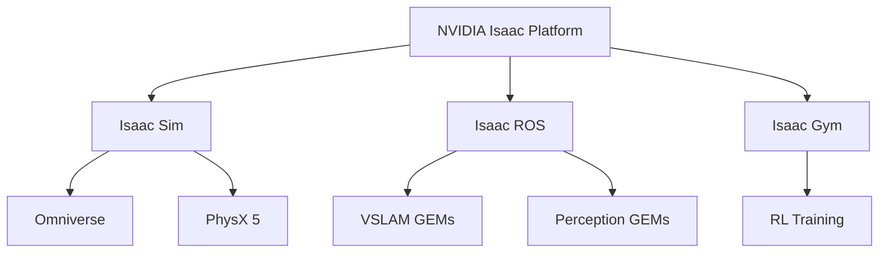

# Chapter 6: NVIDIA Isaac Sim - The Ultimate Robot Simulator

## Learning Objectives

- Understand NVIDIA Isaac platform ecosystem
- Set up Isaac Sim for humanoid robot simulation
- Generate synthetic data for training AI models
- Use Isaac ROS for hardware-accelerated perception
- Implement sim-to-real transfer workflows
- Leverage Omniverse for photorealistic physics

## The NVIDIA Isaac Ecosystem

NVIDIA Isaac is a comprehensive platform for robot development:



| Component | Purpose |
|-----------|---------|
| **Isaac Sim** | Photorealistic simulation built on Omniverse |
| **Isaac ROS** | Hardware-accelerated ROS 2 packages (CUDA/Tensor RT) |
| **Isaac Gym** | Massively parallel RL training (thousands of robots) |
| **Omniverse** | Collaboration platform and USD (Universal Scene Description) |

## Why Isaac Sim?

### Advantages Over Gazebo/Unity

| Feature | Gazebo | Unity | Isaac Sim |
|---------|--------|-------|-----------|
| **Physics** | ODE/DART | PhysX | PhysX 5 (GPU-accelerated) |
| **Graphics** | OGRE | HDRP | RTX Ray Tracing |
| **Sensor Simulation** | Basic | Moderate | Photorealistic (RTX) |
| **Parallel Envs** | 1 | 1 | Thousands (Isaac Gym) |
| **Synthetic Data** | Limited | Moderate | Domain Randomization |
| **ROS Integration** | Native | TCP Bridge | Isaac ROS (hardware-accelerated) |

**Key Differentiator**: **GPU-accelerated everything** (physics, rendering, perception).

## Hardware Requirements

Isaac Sim is demanding:

| Component | Minimum | Recommended |
|-----------|---------|-------------|
| **GPU** | RTX 2080 (8GB VRAM) | RTX 4090 (24GB VRAM) |
| **CPU** | Intel i7 | AMD Ryzen 9 / Intel i9 |
| **RAM** | 32GB | 64GB+ |
| **Storage** | 50GB SSD | 500GB NVMe SSD |
| **OS** | Ubuntu 22.04 | Ubuntu 22.04 |

## Installing Isaac Sim

### Step 1: Install Omniverse Launcher

```bash
# Download from https://www.nvidia.com/en-us/omniverse/download/
wget https://install.launcher.omniverse.nvidia.com/installers/omniverse-launcher-linux.AppImage
chmod +x omniverse-launcher-linux.AppImage
./omniverse-launcher-linux.AppImage
```

### Step 2: Install Isaac Sim via Launcher

1. Open Omniverse Launcher
2. Go to **Exchange** tab
3. Search for "Isaac Sim"
4. Click **Install** (version 2023.1.1 or later)

### Step 3: Verify Installation

```bash
# Launch Isaac Sim
~/.local/share/ov/pkg/isaac_sim-*/isaac-sim.sh
```

## Loading a Humanoid in Isaac Sim

### Using USD (Universal Scene Description)

Isaac Sim uses **USD** (Pixar's format) instead of URDF.

**Convert URDF to USD**:

```bash
# In Isaac Sim Python environment
cd ~/.local/share/ov/pkg/isaac_sim-*/
./python.sh

# In Python shell
from isaacsim import SimulationApp
simulation_app = SimulationApp({"headless": False})

from omni.isaac.core.utils.extensions import enable_extension
enable_extension("omni.isaac.urdf")

import omni.isaac.urdf as urdf_importer

# Convert URDF to USD
urdf_importer.import_robot(
    urdf_path="/path/to/humanoid.urdf",
    usd_path="/path/to/humanoid.usd",
    import_config=urdf_importer.ImportConfig()
)

simulation_app.close()
```

### Loading USD in Scene

```python
from isaacsim import SimulationApp
simulation_app = SimulationApp({"headless": False})

from omni.isaac.core import World
from omni.isaac.core.utils.stage import add_reference_to_stage

# Create world
world = World()

# Load humanoid
add_reference_to_stage(
    usd_path="/path/to/humanoid.usd",
    prim_path="/World/Humanoid"
)

# Run simulation
world.reset()
for i in range(1000):
    world.step(render=True)

simulation_app.close()
```

## Synthetic Data Generation

Isaac Sim excels at generating **labeled training data** for AI models.

### Domain Randomization

Randomize:
- **Lighting**: HDR environments, light positions
- **Textures**: Floor, walls, object materials
- **Object Poses**: Random placement of obstacles
- **Camera Parameters**: FOV, exposure, noise

**Example: Randomizing Lighting**

```python
import omni.replicator.core as rep

with rep.new_layer():
    # Create randomized lights
    def randomize_lights():
        lights = rep.create.light(
            light_type="Sphere",
            temperature=rep.distribution.uniform(3000, 6500),
            intensity=rep.distribution.uniform(1000, 5000),
            position=rep.distribution.uniform((-5, 3, -5), (5, 10, 5)),
            count=5
        )
        return lights.node
    
    # Register randomizer
    rep.randomizer.register(randomize_lights)
    
    # Trigger every frame
    with rep.trigger.on_frame():
        rep.randomizer.randomize_lights()
```

### Generating Labeled Data

```python
import omni.replicator.core as rep

# Set up camera
camera = rep.create.camera(position=(2, 2, 2), look_at=(0, 0, 0))

# Define what to capture
render_product = rep.create.render_product(camera, (640, 480))

# Annotators (labels)
rep.WriterRegistry.register("BasicWriter")
writer = rep.WriterRegistry.get("BasicWriter")
writer.initialize(
    output_dir="/path/to/output",
    rgb=True,
    bounding_box_2d_tight=True,
    semantic_segmentation=True,
    instance_segmentation=True
)
writer.attach([render_product])

# Run for 100 frames
rep.orchestrator.run()
for i in range(100):
    rep.orchestrator.step()
```

**Output**: RGB images + JSON with bounding boxes, segmentation masks.

## Isaac ROS: Hardware-Accelerated Perception

**Isaac ROS** provides ROS 2 packages optimized for NVIDIA GPUs.

### Key GEMs (GPU-Accelerated Modules)

| Package | Function | Speedup |
|---------|----------|---------|
| `isaac_ros_visual_slam` | Visual SLAM | 10-20x |
| `isaac_ros_image_proc` | Image rectification | 5x |
| `isaac_ros_dnn_inference` | Deep learning inference | 100x+ |
| `isaac_ros_apriltag` | AprilTag detection | 15x |

### Installing Isaac ROS

```bash
# Install Isaac ROS common
cd ~/ros2_ws/src
git clone https://github.com/NVIDIA-ISAAC-ROS/isaac_ros_common.git

# Install Visual SLAM
git clone https://github.com/NVIDIA-ISAAC-ROS/isaac_ros_visual_slam.git

# Build
cd ~/ros2_ws
colcon build --packages-up-to isaac_ros_visual_slam
```

### Running Visual SLAM

```bash
# Launch Isaac ROS VSLAM
ros2 launch isaac_ros_visual_slam isaac_ros_visual_slam.launch.py

# Publish camera data (from Isaac Sim or real camera)
ros2 run image_publisher image_publisher_node /path/to/images
```

**Output**: Real-time odometry and 3D map.

## Sim-to-Real Transfer

**Challenge**: Models trained in simulation often fail on real robots due to the "reality gap."

**Solutions**:

### 1. Domain Randomization
Vary simulation parameters to cover real-world diversity.

### 2. System Identification
Measure real robot parameters (mass, friction, motor constants) and match them in simulation.

### 3. Residual Learning
Train a "correction" model on real data to fix sim-trained policies.

**Example Workflow**:

```python
# 1. Train in Isaac Sim (Isaac Gym)
# 2. Export policy weights
# 3. Deploy to Jetson Orin on real robot
# 4. Collect real-world failures
# 5. Fine-tune policy with real data
# 6. Repeat
```

## Lab Exercise: Isaac Sim Hello World

### Objective
Load a humanoid, apply gravity, and observe falling behavior.

### Step 1: Launch Isaac Sim

```bash
~/.local/share/ov/pkg/isaac_sim-*/isaac-sim.sh
```

### Step 2: Python Script

Create `isaac_hello_world.py`:

```python
from isaacsim import SimulationApp
simulation_app = SimulationApp({"headless": False})

from omni.isaac.core import World
from omni.isaac.core.objects import DynamicCuboid
from omni.isaac.core.utils.stage import add_reference_to_stage
import numpy as np

# Create world with physics
world = World()

# Add ground plane
world.scene.add_default_ground_plane()

# Add a cube (proxy for humanoid)
cube = world.scene.add(
    DynamicCuboid(
        prim_path="/World/Cube",
        name="test_cube",
        position=np.array([0, 0, 2.0]),
        size=np.array([0.5, 0.5, 0.5]),
        color=np.array([0.8, 0.2, 0.2])
    )
)

# Reset and run
world.reset()

for i in range(500):
    world.step(render=True)
    if i % 50 == 0:
        pos, _ = cube.get_world_pose()
        print(f"Frame {i}: Cube position = {pos}")

simulation_app.close()
```

### Step 3: Run

```bash
~/.local/share/ov/pkg/isaac_sim-*/python.sh isaac_hello_world.py
```

**Expected**: Cube falls and bounces on the ground.

## Quiz

1. **What is the primary advantage of Isaac Sim over Gazebo?**
   - A) Easier to use
   - B) GPU-accelerated physics and photorealistic rendering
   - C) Better ROS 1 support
   - D) Smaller file size
   
   **Answer: B**

2. **What format does Isaac Sim use for robot models?**
   - A) URDF
   - B) SDF
   - C) USD (Universal Scene Description)
   - D) FBX
   
   **Answer: C**

3. **What is domain randomization used for?**
   - A) Speeding up simulation
   - B) Reducing reality gap by varying simulation parameters
   - C) Compressing models
   - D) Debugging code
   
   **Answer: B**

4. **What does Isaac ROS provide?**
   - A) A new operating system
   - B) Hardware-accelerated ROS 2 packages for NVIDIA GPUs
   - C) A robot chassis
   - D) A programming language
   
   **Answer: B**

## Summary

In this chapter, we explored NVIDIA Isaac Sim, the industry-leading platform for photorealistic robot simulation. We learned to load humanoid models using USD, generate synthetic training data with domain randomization, and leverage Isaac ROS for hardware-accelerated perception. Isaac Sim is essential for training AI models at scale and achieving robust sim-to-real transfer.

**Next Chapter**: We'll dive into VSLAM (Visual Simultaneous Localization and Mapping) and navigation using the Nav2 stack.
