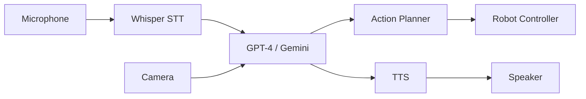

# Chapter 10: Conversational Robotics with LLMs

## Learning Objectives

- Integrate speech recognition (Whisper) with humanoid robots
- Use Large Language Models (GPT-4, Gemini) for natural language understanding
- Implement text-to-speech for robot responses
- Build multi-modal interaction systems (speech + vision + gesture)
- Deploy conversational AI on edge devices (Jetson)
- Create context-aware robot assistants

## The Rise of Conversational Robots

Traditional robots use:
- **Button interfaces**: Limited, unintuitive
- **Pre-programmed commands**: Inflexible
- **Mobile apps**: Requires phone

**Conversational robots** use **natural language**:
- "Robot, bring me a glass of water"
- "What do you see on the table?"
- "Follow me to the kitchen"

### Why Now?

| Technology | Breakthrough |
|------------|--------------|
| **Speech Recognition** | Whisper (OpenAI) - near-human accuracy |
| **Language Models** | GPT-4, Gemini - reasoning and planning |
| **Text-to-Speech** | Eleven Labs, Coqui TTS - natural voices |
| **Edge AI** | Jetson Orin - run models locally |

## Speech-to-Text with Whisper

**Whisper** (OpenAI, 2022) is a robust speech recognition model.

### Features

- **Multilingual**: 99 languages
- **Robust**: Works with noise, accents
- **Fast**: Real-time on GPU
- **Open-source**: Can run locally

### Installation

```bash
pip install openai-whisper
```

### Basic Usage

```python
import whisper

# Load model
model = whisper.load_model("base")  # Options: tiny, base, small, medium, large

# Transcribe audio file
result = model.transcribe("audio.wav")
print(result["text"])
```

### Real-Time Transcription

```python
import pyaudio
import whisper
import numpy as np

class RealtimeWhisper:
    def __init__(self):
        self.model = whisper.load_model("base")
        self.audio = pyaudio.PyAudio()
        self.stream = self.audio.open(
            format=pyaudio.paInt16,
            channels=1,
            rate=16000,
            input=True,
            frames_per_buffer=1024
        )
    
    def listen(self, duration=5):
        """Record audio for 'duration' seconds and transcribe"""
        print("Listening...")
        
        frames = []
        for _ in range(0, int(16000 / 1024 * duration)):
            data = self.stream.read(1024)
            frames.append(data)
        
        # Convert to numpy array
        audio_data = np.frombuffer(b''.join(frames), dtype=np.int16).astype(np.float32) / 32768.0
        
        # Transcribe
        result = self.model.transcribe(audio_data, fp16=False)
        return result["text"]
```

### ROS 2 Integration

```python
import rclpy
from rclpy.node import Node
from std_msgs.msg import String

class WhisperNode(Node):
    def __init__(self):
        super().__init__('whisper_node')
        self.publisher = self.create_publisher(String, 'voice_command', 10)
        self.whisper = RealtimeWhisper()
        
        # Listen every 5 seconds
        self.timer = self.create_timer(5.0, self.listen_callback)
    
    def listen_callback(self):
        text = self.whisper.listen(duration=5)
        if text:
            msg = String()
            msg.data = text
            self.publisher.publish(msg)
            self.get_logger().info(f'Heard: "{text}"')
```

## Language Models for Robot Control

### GPT-4 for Task Planning

```python
from openai import OpenAI

client = OpenAI(api_key="your-api-key")

def plan_task(user_command):
    """
    Convert natural language to robot actions
    """
    prompt = f"""You are a robot assistant. Convert the user's command into a sequence of robot actions.

Available actions:
- navigate(location)
- pick(object)
- place(object, location)
- say(message)

User command: "{user_command}"

Output a JSON list of actions."""

    response = client.chat.completions.create(
        model="gpt-4",
        messages=[
            {"role": "system", "content": "You are a helpful robot assistant."},
            {"role": "user", "content": prompt}
        ]
    )
    
    return response.choices[0].message.content
```

**Example**:

```python
command = "Bring me the red cup from the kitchen"
plan = plan_task(command)
print(plan)
```

**Output**:

```json
[
  {"action": "navigate", "params": {"location": "kitchen"}},
  {"action": "pick", "params": {"object": "red cup"}},
  {"action": "navigate", "params": {"location": "user"}},
  {"action": "place", "params": {"object": "red cup", "location": "table"}},
  {"action": "say", "params": {"message": "Here is your red cup"}}
]
```

### Gemini for Vision + Language

```python
import google.generativeai as genai
from PIL import Image

genai.configure(api_key="your-api-key")

def vision_language_query(image_path, question):
    """
    Ask questions about an image
    """
    model = genai.GenerativeModel('gemini-1.5-flash')
    
    image = Image.open(image_path)
    
    response = model.generate_content([question, image])
    return response.text
```

**Example**:

```python
response = vision_language_query("table.jpg", "What objects are on the table?")
print(response)
# Output: "I see a red cup, a blue plate, and a green apple on the table."
```

## Text-to-Speech

### Using pyttsx3 (Offline)

```python
import pyttsx3

class TextToSpeech:
    def __init__(self):
        self.engine = pyttsx3.init()
        self.engine.setProperty('rate', 150)  # Speed
        self.engine.setProperty('volume', 0.9)  # Volume
    
    def speak(self, text):
        self.engine.say(text)
        self.engine.runAndWait()
```

### Using Google Cloud TTS (Online, High Quality)

```python
from google.cloud import texttospeech
import os

class GoogleTTS:
    def __init__(self):
        self.client = texttospeech.TextToSpeechClient()
    
    def speak(self, text, output_file="output.mp3"):
        synthesis_input = texttospeech.SynthesisInput(text=text)
        
        voice = texttospeech.VoiceSelectionParams(
            language_code="en-US",
            name="en-US-Neural2-F",  # Female voice
            ssml_gender=texttospeech.SsmlVoiceGender.FEMALE
        )
        
        audio_config = texttospeech.AudioConfig(
            audio_encoding=texttospeech.AudioEncoding.MP3
        )
        
        response = self.client.synthesize_speech(
            input=synthesis_input,
            voice=voice,
            audio_config=audio_config
        )
        
        with open(output_file, "wb") as out:
            out.write(response.audio_content)
        
        # Play audio
        os.system(f"mpg123 {output_file}")
```

## Building a Conversational Robot System

### Architecture



### Complete System

```python
import rclpy
from rclpy.node import Node
from std_msgs.msg import String
from sensor_msgs.msg import Image
from geometry_msgs.msg import Twist
import whisper
import google.generativeai as genai
import pyttsx3

class ConversationalRobot(Node):
    def __init__(self):
        super().__init__('conversational_robot')
        
        # Components
        self.whisper_model = whisper.load_model("base")
        genai.configure(api_key=os.getenv("GEMINI_API_KEY"))
        self.gemini = genai.GenerativeModel('gemini-1.5-flash')
        self.tts = pyttsx3.init()
        
        # ROS interfaces
        self.cmd_pub = self.create_publisher(Twist, '/cmd_vel', 10)
        self.image_sub = self.create_subscription(
            Image, '/camera/image_raw', self.image_callback, 10)
        
        self.current_image = None
        
        # Conversation loop
        self.timer = self.create_timer(10.0, self.conversation_loop)
    
    def image_callback(self, msg):
        # Store latest image
        self.current_image = msg
    
    def conversation_loop(self):
        # 1. Listen
        user_command = self.listen()
        if not user_command:
            return
        
        self.get_logger().info(f'User said: "{user_command}"')
        
        # 2. Understand (with vision if needed)
        if "see" in user_command.lower() or "look" in user_command.lower():
            response = self.vision_language_query(user_command)
        else:
            response = self.text_query(user_command)
        
        self.get_logger().info(f'Robot response: "{response}"')
        
        # 3. Speak
        self.speak(response)
        
        # 4. Act (if command involves movement)
        if "forward" in user_command.lower():
            self.move_forward()
        elif "turn" in user_command.lower():
            self.turn()
    
    def listen(self):
        # Simplified: record 5 seconds
        # In practice, use voice activity detection (VAD)
        audio_data = self.record_audio(duration=5)
        result = self.whisper_model.transcribe(audio_data)
        return result["text"]
    
    def text_query(self, question):
        response = self.gemini.generate_content(question)
        return response.text
    
    def vision_language_query(self, question):
        if self.current_image is None:
            return "I don't have a camera feed."
        
        # Convert ROS image to PIL
        image = self.ros_image_to_pil(self.current_image)
        
        response = self.gemini.generate_content([question, image])
        return response.text
    
    def speak(self, text):
        self.tts.say(text)
        self.tts.runAndWait()
    
    def move_forward(self):
        cmd = Twist()
        cmd.linear.x = 0.5
        self.cmd_pub.publish(cmd)
        self.get_logger().info('Moving forward')
    
    def turn(self):
        cmd = Twist()
        cmd.angular.z = 0.5
        self.cmd_pub.publish(cmd)
        self.get_logger().info('Turning')
```

## Context-Aware Conversations

### Maintaining Conversation History

```python
class ContextAwareRobot:
    def __init__(self):
        self.conversation_history = []
    
    def chat(self, user_input):
        # Add user message to history
        self.conversation_history.append({
            "role": "user",
            "content": user_input
        })
        
        # Query LLM with full history
        response = client.chat.completions.create(
            model="gpt-4",
            messages=[
                {"role": "system", "content": "You are a helpful robot assistant."},
                *self.conversation_history
            ]
        )
        
        assistant_message = response.choices[0].message.content
        
        # Add assistant response to history
        self.conversation_history.append({
            "role": "assistant",
            "content": assistant_message
        })
        
        return assistant_message
```

**Example**:

```python
robot = ContextAwareRobot()

print(robot.chat("What's on the table?"))
# "I see a red cup and a blue plate."

print(robot.chat("Pick up the red one"))
# "Picking up the red cup." (understands "red one" refers to the cup)
```

## Lab Exercise: Voice-Controlled Navigation

### Objective
Build a robot that navigates based on voice commands.

### Step 1: Set Up Whisper Node

```bash
ros2 run conversational_robot whisper_node
```

### Step 2: Set Up Command Interpreter

```python
class VoiceNavigationNode(Node):
    def __init__(self):
        super().__init__('voice_navigation')
        self.subscription = self.create_subscription(
            String, 'voice_command', self.command_callback, 10)
        self.cmd_pub = self.create_publisher(Twist, '/cmd_vel', 10)
    
    def command_callback(self, msg):
        command = msg.data.lower()
        
        if "forward" in command or "ahead" in command:
            self.move_forward()
        elif "back" in command or "backward" in command:
            self.move_backward()
        elif "left" in command:
            self.turn_left()
        elif "right" in command:
            self.turn_right()
        elif "stop" in command:
            self.stop()
    
    def move_forward(self):
        cmd = Twist()
        cmd.linear.x = 0.5
        self.cmd_pub.publish(cmd)
    
    # ... other movement methods
```

### Step 3: Test

```bash
# Terminal 1: Launch Gazebo
ros2 launch humanoid_gazebo world.launch.py

# Terminal 2: Whisper node
ros2 run conversational_robot whisper_node

# Terminal 3: Navigation node
ros2 run conversational_robot voice_navigation_node

# Speak: "Move forward"
```

## Quiz

1. **What is Whisper used for?**
   - A) Text generation
   - B) Speech-to-text
   - C) Image recognition
   - D) Robot control
   
   **Answer: B**

2. **Which model is best for vision + language tasks?**
   - A) GPT-3
   - B) BERT
   - C) Gemini 1.5 Flash
   - D) ResNet
   
   **Answer: C**

3. **Why maintain conversation history?**
   - A) To save memory
   - B) To enable context-aware responses
   - C) To speed up inference
   - D) To reduce API costs
   
   **Answer: B**

4. **What is the advantage of running TTS locally?**
   - A) Better voice quality
   - B) No internet required, lower latency
   - C) More languages
   - D) Cheaper
   
   **Answer: B**

## Summary

In this chapter, we integrated conversational AI with humanoid robots. We used Whisper for speech recognition, GPT-4/Gemini for natural language understanding and task planning, and TTS for robot responses. We built a complete conversational robot system that can understand voice commands, answer questions about its environment, and execute tasks. Conversational interfaces make robots accessible to everyone, not just programmers.

**Next Chapter**: We'll bring everything together in the capstone project—building an autonomous humanoid that navigates, manipulates objects, and responds to voice commands.
