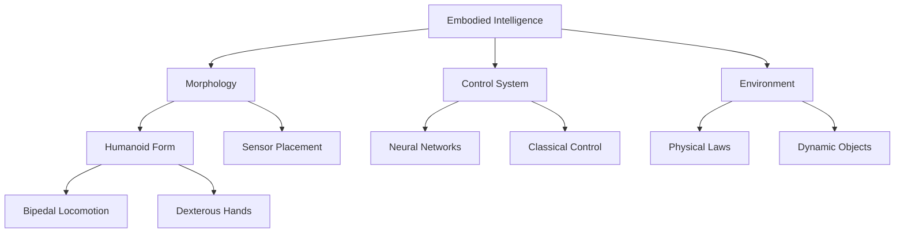

# Introduction to Physical AI & Embodied Intelligence

## Learning Objectives

By the end of this chapter, you will be able to:
- Define Physical AI and distinguish it from traditional Generative AI
- Understand the fundamental concept of Embodied Intelligence
- Identify the key components of Physical AI systems
- Explore the historical evolution and future trajectory of Humanoid Robotics
- Recognize the importance of sensor-motor integration in robotic systems

## What is Physical AI?

**Physical AI** represents a paradigm shift from purely digital artificial intelligence to AI systems that perceive, reason about, and interact with the physical world. While Generative AI models like ChatGPT excel at processing and generating text, images, or code in digital domains, Physical AI agents—embodied as robots—must navigate the complexities of real-world environments.

### The Digital-to-Physical Bridge

Traditional AI operates in controlled, deterministic digital environments where:
- Input is structured and predictable
- Actions have immediate, calculable consequences
- The environment is static and fully observable

Physical AI, however, must contend with:
- **Uncertainty**: Sensor noise, incomplete information, and unpredictable events
- **Dynamics**: Moving objects, changing lighting, and evolving environments
- **Real-time constraints**: Decisions must be made within milliseconds
- **Safety-critical operations**: Mistakes can cause physical harm

### Key Components of Physical AI Systems

Physical AI systems integrate three fundamental capabilities:

#### 1. **Perception** 
The ability to sense and interpret the environment through various sensors:

- **Vision Systems**: RGB cameras, depth cameras (stereo, structured light, ToF)
- **LiDAR**: Light Detection and Ranging for 3D mapping
- **IMU**: Inertial Measurement Units for orientation and acceleration
- **Force/Torque Sensors**: For manipulation and contact detection
- **Proprioception**: Joint encoders for self-awareness of body position

```python
# Example: Reading sensor data in ROS 2
import rclpy
from sensor_msgs.msg import Image, LaserScan, Imu

class SensorFusion(Node):
    def __init__(self):
        super().__init__('sensor_fusion')
        
        # Subscribe to multiple sensors
        self.camera_sub = self.create_subscription(
            Image, '/camera/image_raw', self.camera_callback, 10)
        self.lidar_sub = self.create_subscription(
            LaserScan, '/scan', self.lidar_callback, 10)
        self.imu_sub = self.create_subscription(
            Imu, '/imu/data', self.imu_callback, 10)
    
    def camera_callback(self, msg):
        # Process visual data
        self.get_logger().info(f'Received image: {msg.width}x{msg.height}')
    
    def lidar_callback(self, msg):
        # Process range data
        min_distance = min(msg.ranges)
        self.get_logger().info(f'Closest obstacle: {min_distance:.2f}m')
    
    def imu_callback(self, msg):
        # Process orientation data
        self.get_logger().info(f'Orientation: {msg.orientation}')
```

#### 2. **Reasoning**
The cognitive layer that processes sensory information and makes decisions:

- **Planning**: Path planning, task planning, motion planning
- **Navigation**: Localization, mapping (SLAM), obstacle avoidance
- **Decision Making**: Reinforcement learning, behavior trees, state machines
- **Prediction**: Anticipating future states of dynamic environments

#### 3. **Actuation**
The physical execution of planned actions through motors and actuators:

- **Electric Motors**: Servo motors, stepper motors, brushless DC motors
- **Hydraulic Actuators**: High-force applications (e.g., Boston Dynamics Atlas)
- **Pneumatic Systems**: Soft robotics and compliant manipulation
- **Series Elastic Actuators (SEA)**: Force-controlled manipulation

## Embodied Intelligence

The concept of **Embodied Intelligence** challenges the traditional view that intelligence is purely computational. Instead, it posits that:

> *Intelligence emerges from the dynamic interaction between an agent's body (morphology), its control system (brain), and its environment.*

### Morphological Computation

A robot's physical structure can simplify control problems. For example:
- **Passive walkers** can descend slopes without motors, using only gravity and mechanical design
- **Compliant grippers** adapt to object shapes without complex sensing
- **Quadrupeds** are inherently more stable than bipeds due to their four-legged morphology

### Why Humanoid Form?

Humanoid robots are designed to mimic human morphology for several strategic reasons:

1. **Human-Centered Environments**: Our world is built for humans—stairs, doorknobs, chairs, tools
2. **Data Abundance**: Millions of hours of human motion data (YouTube, motion capture) can train humanoid policies
3. **Social Acceptance**: Human-like appearance facilitates natural interaction
4. **Versatility**: Two arms, two legs, and an upright posture enable diverse tasks



## The Evolution of Humanoid Robotics

### Historical Milestones

| Year | Robot | Significance |
|------|-------|--------------|
| 1973 | WABOT-1 | First full-scale humanoid (Waseda University) |
| 2000 | ASIMO | Honda's iconic walking humanoid |
| 2013 | Atlas | DARPA Robotics Challenge winner (hydraulic) |
| 2021 | Tesla Bot Announcement | Mass-market humanoid vision |
| 2023 | Figure 01 | OpenAI-powered conversational humanoid |
| 2024 | Atlas Electric | Boston Dynamics' electric humanoid |

### The Current Landscape (2024-2025)

We are witnessing an **inflection point** in humanoid robotics driven by:

1. **Foundation Models**: Large language models (GPT-4, Gemini) enable natural language control
2. **Vision-Language-Action (VLA)**: End-to-end models that map pixels to actions
3. **Simulation**: NVIDIA Isaac Sim and others enable massive-scale training
4. **Manufacturing Scale**: Tesla's Optimus aims for mass production

## Physical AI vs. Generative AI

| Aspect | Generative AI | Physical AI |
|--------|---------------|-------------|
| **Domain** | Digital (text, images, code) | Physical world |
| **Input** | Structured data | Noisy sensor data |
| **Output** | Tokens, pixels | Motor commands |
| **Feedback Loop** | Immediate | Delayed (physical dynamics) |
| **Safety** | Low risk | Safety-critical |
| **Evaluation** | Accuracy, coherence | Task success, safety |

## Real-World Applications

### Industrial
- **Warehouse Automation**: Digit (Agility Robotics) for package handling
- **Manufacturing**: Collaborative robots (cobots) for assembly

### Healthcare
- **Rehabilitation**: Exoskeletons for mobility assistance
- **Surgery**: Da Vinci surgical systems

### Domestic
- **Home Assistance**: Future vision of humanoids performing household chores
- **Eldercare**: Companionship and physical assistance

### Exploration
- **Space**: NASA's Valkyrie for Mars missions
- **Disaster Response**: Search and rescue in hazardous environments

## Quiz

Test your understanding of the concepts covered:

1. **What is the primary difference between Generative AI and Physical AI?**
   - A) Generative AI is more intelligent
   - B) Physical AI interacts with the physical world through sensors and actuators
   - C) Generative AI uses neural networks
   - D) Physical AI doesn't use machine learning
   
   **Answer: B** - Physical AI must perceive and act in the real world, dealing with uncertainty and physical constraints.

2. **Which of the following is NOT a component of Physical AI systems?**
   - A) Perception
   - B) Reasoning
   - C) Actuation
   - D) Tokenization
   
   **Answer: D** - Tokenization is relevant to language models, not the core components of Physical AI.

3. **What does "Embodied Intelligence" suggest?**
   - A) Intelligence only exists in biological systems
   - B) Intelligence emerges from body-environment interaction
   - C) Robots should look exactly like humans
   - D) Physical AI is impossible
   
   **Answer: B** - Embodied intelligence emphasizes the role of physical morphology in cognitive processes.

4. **Why are humanoid robots advantageous for human environments?**
   - A) They are cheaper to build
   - B) They can use tools and navigate spaces designed for humans
   - C) They are more stable than other robot forms
   - D) They require less computation
   
   **Answer: B** - Humanoid form factors allow robots to operate in environments built for human morphology.

## Lab Exercise: Setting Up Your Physical AI Development Environment

### Prerequisites
- A computer with Ubuntu 22.04 LTS (native or VM)
- At least 16GB RAM (32GB recommended)
- NVIDIA GPU (RTX series recommended for simulation)

### Step 1: Install ROS 2 Humble

```bash
# Set locale
sudo apt update && sudo apt install locales
sudo locale-gen en_US en_US.UTF-8
sudo update-locale LC_ALL=en_US.UTF-8 LANG=en_US.UTF-8
export LANG=en_US.UTF-8

# Setup sources
sudo apt install software-properties-common
sudo add-apt-repository universe
sudo apt update && sudo apt install curl -y
sudo curl -sSL https://raw.githubusercontent.com/ros/rosdistro/master/ros.key -o /usr/share/keyrings/ros-archive-keyring.gpg

echo "deb [arch=$(dpkg --print-architecture) signed-by=/usr/share/keyrings/ros-archive-keyring.gpg] http://packages.ros.org/ros2/ubuntu $(. /etc/os-release && echo $UBUNTU_CODENAME) main" | sudo tee /etc/apt/sources.list.d/ros2.list > /dev/null

# Install ROS 2 Humble
sudo apt update
sudo apt upgrade
sudo apt install ros-humble-desktop python3-argcomplete
sudo apt install ros-dev-tools

# Source the setup file
echo "source /opt/ros/humble/setup.bash" >> ~/.bashrc
source ~/.bashrc
```

### Step 2: Install Docker

```bash
# Install Docker
curl -fsSL https://get.docker.com -o get-docker.sh
sudo sh get-docker.sh

# Add user to docker group
sudo usermod -aG docker $USER
newgrp docker

# Verify installation
docker --version
```

### Step 3: Create Your First ROS 2 Node

```bash
# Create a workspace
mkdir -p ~/ros2_ws/src
cd ~/ros2_ws/src

# Create a package
ros2 pkg create --build-type ament_python hello_physical_ai --dependencies rclpy

# Navigate to the package
cd hello_physical_ai/hello_physical_ai
```

Create a file called `hello_node.py`:

```python
#!/usr/bin/env python3
import rclpy
from rclpy.node import Node

class HelloPhysicalAI(Node):
    def __init__(self):
        super().__init__('hello_physical_ai')
        self.timer = self.create_timer(1.0, self.timer_callback)
        self.counter = 0
        self.get_logger().info('Hello Physical AI Node Started!')
    
    def timer_callback(self):
        self.counter += 1
        self.get_logger().info(f'Physical AI Heartbeat: {self.counter}')

def main(args=None):
    rclpy.init(args=args)
    node = HelloPhysicalAI()
    rclpy.spin(node)
    node.destroy_node()
    rclpy.shutdown()

if __name__ == '__main__':
    main()
```

### Step 4: Build and Run

```bash
# Return to workspace root
cd ~/ros2_ws

# Build the package
colcon build --packages-select hello_physical_ai

# Source the workspace
source install/setup.bash

# Run the node
ros2 run hello_physical_ai hello_node
```

**Expected Output:**
```
[INFO] [hello_physical_ai]: Hello Physical AI Node Started!
[INFO] [hello_physical_ai]: Physical AI Heartbeat: 1
[INFO] [hello_physical_ai]: Physical AI Heartbeat: 2
[INFO] [hello_physical_ai]: Physical AI Heartbeat: 3
...
```

### Verification Checklist
- [ ] ROS 2 Humble installed successfully
- [ ] Docker installed and running
- [ ] First ROS 2 node created and executed
- [ ] Able to see log messages in terminal

## Further Reading

- **Books**:
  - "Probabilistic Robotics" by Thrun, Burgard, and Fox
  - "Modern Robotics" by Lynch and Park
  
- **Papers**:
  - "Embodied Intelligence" by Pfeifer and Bongard
  - "RT-1: Robotics Transformer" by Google Research
  
- **Online Resources**:
  - [ROS 2 Documentation](https://docs.ros.org/en/humble/)
  - [NVIDIA Isaac Documentation](https://docs.omniverse.nvidia.com/isaacsim/latest/)

## Summary

In this chapter, we established the foundational concepts of Physical AI and Embodied Intelligence. We learned that Physical AI extends beyond digital computation to systems that perceive, reason about, and act in the physical world. The humanoid form factor is particularly promising due to its compatibility with human-designed environments and the abundance of training data. We also set up our development environment with ROS 2 and Docker, preparing us for the hands-on journey ahead.

**Next Chapter**: We'll explore the landscape of modern humanoid robotics platforms and analyze their key features and capabilities.
